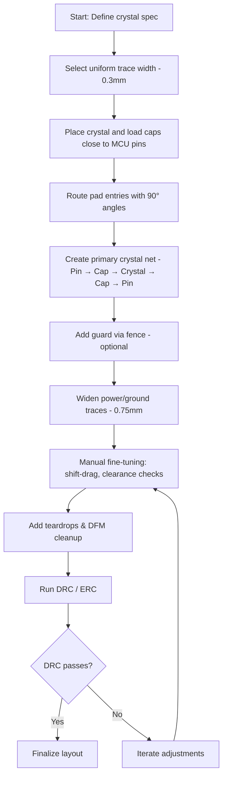

# Routing the Crystal Oscillator and ROSC

## 1. Overview  

The crystal oscillator and the internal RC‑oscillator (ROSC) form the timing core of most micro‑controller designs. Because the crystal network is highly sensitive to stray capacitance, impedance discontinuities, and electromagnetic interference, its layout must be treated as a **critical signal path**. The guidelines below capture a proven workflow for routing these structures while maintaining manufacturability, signal integrity, and mechanical robustness.

---

## 2. Trace‑Width Policy  

A single, uniform trace width is preferred for most signal routing to simplify **Design‑for‑Manufacturability (DFM)** and to keep the design compatible with a wide range of fab houses.  

| Application | Recommended practice |
|-------------|----------------------|
| General‑purpose signals (including crystal pins) | Use a modest width (≈ 0.3 mm) that satisfies the fab’s minimum trace rule and provides reasonable impedance for non‑controlled lines. [Verified] |
| Low‑inductance power or ground connections (e.g., VEF, VDD) | Widen the trace (e.g., 0.75 mm) to minimise loop inductance and improve decoupling effectiveness. [Verified] |
| Controlled‑impedance high‑speed lines (USB, UART, etc.) | Switch to a stack‑up‑specific width calculated for the target impedance (typically 45 Ω‑90 Ω differential). [Inference] |

When a controlled‑impedance requirement arises, the designer should recalculate the width based on the dielectric thickness and copper weight, but for the crystal network a standard width is usually sufficient because the frequencies are modest (typically 4 – 32 MHz).

---

## 3. Pad Entry Geometry  

### 3.1 90° Pad Entries  

Entering a pad at a right angle yields a smooth current transition and eliminates acute corners that can become **acid traps** during etching. Manufacturers have reported over‑etching at sharp angles, which can thin the copper and increase resistance.  

* **Rule:** Route into and out of every pad with a 90° bend whenever possible.  
* **Benefit:** Improves etch reliability and reduces the risk of open or high‑resistance connections. [Verified]

### 3.2 Teardrops  

Teardrops blend the trace into the pad, further mitigating stress concentrations and providing a safety margin for slight mis‑alignments during assembly. They are added **after** the primary routing is complete.  

* **When to add:** Once the net topology is finalised and DRC passes.  
* **Effect:** Enhances mechanical robustness and eases solder flow. [Inference]

---

## 4. Routing the Crystal Network  

### 4.1 Signal Path  

1. **Micro‑controller pins** – Pin 11 (HFX_IN) and Pin 12 (HFX_OUT) are the crystal’s drive and sense nodes.  
2. **Load capacitors** – Typically two capacitors (C₁, C₂) are placed as close as possible to the pins.  
3. **Crystal** – The crystal sits between the two capacitors, forming a series‑parallel resonant circuit.  

The routing sequence is:

```
Pin → Capacitor → Crystal → Capacitor → Pin
```

* **Avoidance of digital clutter:** Keep the crystal trace away from high‑speed digital lines (USB, UART, etc.) to prevent coupling of switching noise into the resonant circuit. [Verified]  
* **Straight‑through routing:** After exiting the pad, use a short straight segment to the first capacitor, then a gentle 90° turn into the crystal. This minimizes trace length and reduces parasitic inductance. [Inference]

### 4.2 Manual Fine‑Tuning  

Even with autorouting assistance, manual adjustments are often required:

* **Shift‑drag technique:** Hold **Shift** while dragging a segment to nudge it onto a finer grid, allowing precise clearance control.  
* **Segment selection:** Click a segment, then drag the endpoint to create a clean right‑angle corner or to provide clearance for adjacent nets.  

These operations help maintain the required **creepage and clearance** distances dictated by the board’s voltage rating.

---

## 5. Guarding Sensitive Sections  

### 5.1 Via Stitching (Guard Traces)  

Placing a fence of grounded vias around the crystal area can act as a **shield** against nearby aggressor signals. The effectiveness depends on:

* **Via spacing:** Must be tight enough that the electromagnetic field of the aggressor cannot penetrate the fence. Typical spacing is ≤ 3 × trace width. [Speculation]  
* **Proximity to aggressors:** If high‑speed lines (e.g., RTS/CTS) must cross the fence, the guard may be incomplete; nevertheless, the fence still provides a visual cue to keep other nets at a distance. [Inference]

### 5.2 Practical Implementation  

1. **Place vias** in a rectangular pattern surrounding the crystal and its load capacitors.  
2. **Connect** all guard vias to a solid ground plane (or a dedicated analog ground) via short, wide traces.  
3. **Leave openings** only where necessary for required signal crossings (e.g., RTS/CTS).  

The guard does not replace proper layout separation but serves as an additional EMI mitigation layer and a visual reminder during routing. [Verified]

---

## 6. Power and Ground Trace Sizing  

Low‑inductance connections are crucial for decoupling capacitors that feed the micro‑controller core.  

* **Ground return for crystal:** Keep the ground path as short and wide as possible; a 0.75 mm trace is a good baseline for a typical 2‑layer board.  
* **Power rails (VDD, VEF):** Use the same wide‑trace strategy to minimise voltage droop during transient current spikes.  

Wider traces reduce the **loop area** formed by the signal and its return, thereby lowering both inductance and susceptibility to radiated interference. [Verified]

---

## 7. Recommended Layout Workflow  

The following flowchart summarises a repeatable process for routing the crystal and ROSC while respecting DFM constraints.



*The flow emphasizes early decisions (trace width, component placement) that cascade into later DFM refinements.* [Inference]

---

## 8. Key Takeaways  

| Aspect | Best Practice |
|--------|----------------|
| **Trace width** | Use a single, modest width for most signals; widen only power/ground nets. |
| **Pad entry** | Prefer 90° entries; avoid acute angles to prevent acid traps. |
| **Teardrops** | Add after routing to improve mechanical reliability. |
| **Crystal routing** | Keep the path short, straight, and isolated from noisy digital nets. |
| **Guarding** | Deploy via stitching where feasible; treat it as a visual and EMI aid. |
| **Power/ground** | Use wide traces to minimise inductance and support decoupling. |
| **Manual adjustments** | Leverage shift‑drag and grid tweaks for precise clearance control. |

By adhering to these guidelines, designers can achieve a robust, manufacturable crystal/ROSC layout that meets timing accuracy requirements while maintaining overall board reliability.