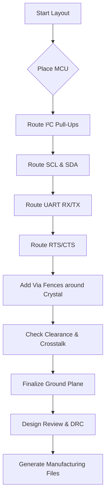

# Routing I²C & UART Signals  

*This section documents best‑practice routing techniques for the I²C bus and UART interface on a typical 2‑layer (or mixed‑layer) board. The guidelines are derived from a successful layout implementation and are applicable to similar low‑to‑moderate‑speed digital designs.*

---

## 1. Overview  

I²C and UART are the most common serial interfaces on microcontroller‑centric boards. Although they operate at relatively low frequencies, careful routing is still required to preserve signal integrity, minimise electromagnetic interference (EMI), and satisfy manufacturability rules. The key objectives are:

1. **Maintain adequate clearance** between signal traces, power/ground planes, and high‑frequency components (e.g., crystal).  
2. **Avoid long parallel runs** of unrelated signals to reduce capacitive crosstalk.  
3. **Provide clean pad entry** (gradual neck‑down) to avoid acute angles and ensure reliable solder joints.  
4. **Keep the reference plane (ground) solid** under the routing layer to control return paths and minimise radiation.  

The following subsections detail how these goals were achieved for the I²C and UART nets.

---

## 2. General Routing Guidelines  

| Guideline | Rationale |
|-----------|-----------|
| **Use 0.3 mm trace width for standard‑speed digital signals** (e.g., I²C, UART) unless a specific impedance requirement exists. | Sufficient for ≤ 400 kHz I²C and ≤ 115.2 kbps UART, while keeping the copper area modest. [Verified] |
| **Route on the top layer whenever possible**; reserve the bottom layer for a continuous ground plane and occasional short jumps. | A solid reference plane reduces loop area and improves EMI performance. [Verified] |
| **Apply a minimum clearance of at least 0.2 mm (or the manufacturer’s DRC limit) between unrelated nets**. | Provides a safety margin against accidental shorts and reduces capacitive coupling. [Verified] |
| **Prefer 45° or gentle curves over acute 90° corners**; use “neck‑down” when entering a pad. | Prevents impedance discontinuities and eases solder flow. [Verified] |
| **Keep traces away from the board edge when they sit above a reference plane**. | Edge proximity allows fields to leak off the board, increasing radiated emissions. [Inference] |
| **Separate high‑frequency or noisy nets (e.g., crystal, RTS/CTS) from low‑speed I²C lines**. | Minimises the risk of the crystal’s harmonic content coupling into the bus. [Inference] |

---

## 3. I²C Bus Routing  

### 3.1 Pull‑up Resistor Placement  

* Pull‑up resistors are placed close to the MCU pins (SCL, SDA) to minimise the effective bus capacitance.  
* The routing leaves a small “dent” in the SDA trace to provide clearance for the adjacent UART CTS/RTS lines and the crystal.  

### 3.2 Trace Geometry  

* **SCL**: Routed with a slight upward offset to increase clearance from SDA, avoiding long parallel sections.  
* **SDA**: Kept short, with a gentle neck‑down into the accelerometer pads. When the trace approaches a nearby voltage net (V), the trace is nudged rightward and downward to preserve spacing.  

### 3.3 Crosstalk Mitigation  

* Parallel runs between SCL and SDA are intentionally limited to a few millimetres.  
* Where unavoidable, the designer increased the spacing between the two lines, accepting a modest increase in bus length. This practice reduces capacitive coupling, which can otherwise cause spurious data errors. [Verified]  

### 3.4 Pad Entry  

* Both SCL and SDA use a tapered entry (≈ 30 % width reduction) before the pad, ensuring a smooth current transition and reliable solder fillet formation.  

---

## 4. UART Routing (RX, TX, RTS, CTS)  

### 4.1 Primary UART Signals (RX/TX)  

* **RX** and **TX** are routed with 0.3 mm width, keeping a generous gap from the 3.3 V power net to allow placement of a decoupling capacitor directly adjacent to the MCU pin.  
* The trace exits the MCU pad, bends away from the power pad, and proceeds toward the connector, avoiding any crossing with the I²C bus.  

### 4.2 Flow‑Control Lines (RTS/CTS)  

* RTS and CTS are treated as separate, low‑speed digital lines.  
* The routing strategy mirrors that of the I²C bus: keep the lines short, avoid hugging other traces, and maintain a clear “no‑go” zone around the crystal oscillator.  
* A **via fence** is placed around the crystal to enforce a keep‑out region; RTS/CTS are routed around this fence rather than over the crystal. This reduces the risk of the crystal’s high‑Q resonances coupling into the UART lines. [Inference]  

### 4.3 Parallelism and Spacing  

* Although RTS and CTS run roughly parallel for a short distance, the designer added extra spacing to mitigate crosstalk.  
* The decision to prioritize distance from the crystal over a perfectly straight path reflects a trade‑off between layout simplicity and EMI control. [Inference]  

---

## 5. Managing Crosstalk & EMI  

1. **Increase spacing** between any two signal traces that run parallel for more than a few millimetres.  
2. **Avoid routing near the edge** of a reference plane; instead, keep traces well within the copper pour to confine electromagnetic fields.  
3. **Limit trace length** wherever possible. Shorter traces have lower inductance and present a smaller antenna, reducing unintended radiation.  
4. **Maintain a solid ground plane** on the opposite layer; this provides a low‑impedance return path and suppresses loop area.  

These practices collectively lower the probability of signal integrity issues and help the board pass EMI compliance testing. [Verified]

---

## 6. Pad Entry, Neck‑Down, and Via Usage  

* **Neck‑down**: When a trace approaches a pad, the width is gradually reduced (typically to 60 % of the main trace width) before the pad edge. This reduces the abrupt change in impedance and eases solder flow.  
* **Via placement**: Critical nets (e.g., UART TX before the decoupling capacitor) use a via placed as close as possible to the pad to keep the return path short. Vias are also used to transition to the bottom layer only when absolutely necessary, preserving the top‑layer ground plane continuity.  
* **Via fences**: A series of closely spaced vias can be placed around sensitive components (e.g., crystal) to create a virtual guard ring, discouraging other traces from crossing the keep‑out area.  

---

## 7. Power‑Net Considerations (Brief)  

* The 3.3 V rail is fanned out through the pull‑up network and decoupling capacitors before reaching the MCU.  
* While the primary focus of this chapter is signal routing, the designer noted the need for a later “jumper” to connect the 3.3 V nets, indicating that power distribution will be refined after the signal routing is locked down. [Inference]  

---

## 8. Design Review Checklist (Signal Routing)  

| ✔︎ Item | Description |
|--------|-------------|
| **Clearance** | Minimum spacing between all nets ≥ manufacturer DRC limit; extra margin around crystal and high‑speed nets. |
| **Parallel Runs** | No two unrelated signals run parallel for > 5 mm without added spacing. |
| **Pad Entry** | All signals use tapered neck‑down into pads; no acute 90° corners. |
| **Ground Plane** | Continuous ground plane on the opposite layer; no cuts beneath critical traces. |
| **Edge Proximity** | No signal trace within 1 mm of the board edge when over a reference plane. |
| **Via Usage** | Vias placed only where necessary; keep‑out fences around crystal implemented. |
| **Crosstalk Mitigation** | Spacing increased where parallelism unavoidable; verify with ERC/DRC. |
| **Length Optimization** | Trace lengths kept as short as practical; no unnecessary detours. |

---

## 9. High‑Level Routing Flow (Mermaid Diagram)

*The diagram summarises the logical order of routing actions, emphasizing the early placement of critical nets (I²C, UART) before finalising the ground plane and performing design rule checks.*  

---

## 10. Conclusions  

By adhering to disciplined routing practices—maintaining clearances, limiting parallelism, using proper pad entry, and respecting the proximity of sensitive components—the I²C and UART interfaces can be implemented with high reliability and minimal EMI impact. The approach described here balances manufacturability, signal integrity, and layout simplicity, providing a solid template for future low‑to‑moderate‑speed digital designs.