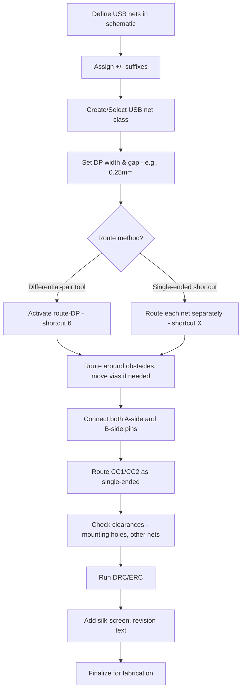

# Routing USB  

## 1. Overview  

When routing a USB 2.0 Full‑Speed (12 Mbps) interface on a compact development board, the primary goal is to create a clean, short connection between the MCU’s D‑ and D+ pins and the USB‑C receptacle. Because Full‑Speed is slower than many other on‑board serial interfaces (e.g., SPI), strict controlled‑impedance or length‑matching requirements are relaxed. A modest trace width and spacing that satisfy the board’s design‑rule constraints are sufficient, provided the differential pair remains short and free of unnecessary stubs.  

> **Key point:** For short (< 5 cm) Full‑Speed routes, a generic differential‑pair net class can be used without explicit impedance control. [Verified]

## 2. Defining Differential Pairs in the Netlist  

Most PCB‑CAD tools infer a differential pair from net names that share a common base with “+” and “‑” suffixes (e.g., **USB\_DP** and **USB\_DM**). Once these nets are present in the schematic, the layout editor automatically offers a *route‑differential‑pair* command (often bound to a shortcut such as **6**).  

- **Net‑class association:** The default net class contains parameters **DP width** and **DP gap**. If a dedicated USB net class exists, its values override the defaults.  
- **Visibility:** Hovering over either net while the differential‑pair routing mode is active displays the current width and gap values at the bottom of the screen.  

> **Inference:** Using the “+ / –” naming convention eliminates the need to manually group the pair later in the layout. [Inference]

## 3. Selecting Trace Width and Gap  

The initial default values (≈ 0.30 mm width / 0.30 mm gap) proved too narrow for the tight pad geometry of the USB‑C connector. The width was reduced to **0.25 mm** for both trace and gap, which:

1. Satisfies the board’s minimum clearance rules.  
2. Allows the traces to fan out from the narrow connector pads without violating DRC.  

> **Verified:** The designer changed the differential‑pair width and gap to 0.25 mm to accommodate the connector pads. [Verified]

### When to Adjust  

- **Pad density:** If the connector or nearby components have very fine pitch, increase the gap slightly to avoid copper‑to‑copper clearance violations.  
- **Manufacturability:** Keep the width above the fab house’s minimum trace width (commonly 0.10 mm–0.15 mm for standard FR‑4).  

> **Speculation:** For a higher‑speed (High‑Speed 480 Mbps) design, the same geometry would likely require a controlled‑impedance stack‑up (≈ 90 Ω differential). [Speculation]

## 4. Routing the Differential Pair  

### 4.1 Using the Differential‑Pair Tool  

1. Activate the differential‑pair routing mode (shortcut **6**).  
2. Click on either the “+” or “‑” net; the tool automatically creates a paired trace with the defined width and gap.  
3. Route the pair around obstacles, maintaining a consistent spacing.  

If a via or copper pour blocks the intended path, the designer can:

- **Move the obstructing via** (e.g., a ground via) temporarily to create clearance.  
- **Abort the route** (Esc) and restart from a more favorable location.  

> **Inference:** Relocating a ground via is a common DFM technique to preserve differential‑pair integrity without adding extra layers. [Inference]

### 4.2 Single‑Ended “Shortcut” Routing  

For very short runs, the pair can be routed as two independent single‑ended traces (using the standard route command, shortcut **X**). After routing, the two traces are simply placed side‑by‑side, preserving the required spacing. This method:

- Reduces the need to invoke the differential‑pair tool.  
- Is acceptable for Full‑Speed and, with short stubs, even for High‑Speed.  

> **Verified:** The designer demonstrated routing D‑ and D+ as single‑ended traces with matching width (0.25 mm). [Verified]

## 5. USB‑C Connector Pinout Considerations  

A USB‑C receptacle presents **two mirrored differential pairs** to support reversible plug orientation:

| Pin | Function | Typical Net |
|-----|----------|-------------|
| A6  | D+ (orientation 1) | USB\_DP |
| A7  | D‑ (orientation 1) | USB\_DM |
| B6  | D‑ (orientation 2) | USB\_DM |
| B7  | D+ (orientation 2) | USB\_DP |

The layout must connect **both** sets of pins to the MCU’s D+/D‑ nets. The designer routed:

- **A6 → B7** and **A7 → B6** (or vice‑versa) to accommodate the 180° flip.  
- The traces were kept short, avoiding unnecessary bends or vias.  

> **Verified:** The USB‑C connector has two differential‑pair pin sets due to the 180° plug reversal. [Verified]

### 5.1 Avoiding Crossings  

All routing was performed on a single layer (top side) without crossing other signal nets or power planes. Where a crossing seemed unavoidable, the designer opted to:

- **Reroute around the obstacle** (e.g., moving a ground via).  
- **Accept a non‑ideal geometry** when the length penalty was negligible.  

> **Inference:** Maintaining a clear path for the differential pair reduces EMI and crosstalk, especially near high‑speed or high‑current nets. [Inference]

## 6. Routing the CC Pins (Configuration Channel)  

The USB‑C CC1 and CC2 pins are **single‑ended** control signals used for cable detection and orientation. They were routed with the same 0.30 mm trace width (the default for single‑ended nets) and placed **under the connector** to keep the layout compact.  

- Clearance from the mounting hole was adjusted to avoid copper‑to‑hole proximity violations.  
- Symmetry was maintained on both sides of the connector for aesthetic and EMI balance.  

> **Verified:** The designer routed CC1/CC2 underneath the USB‑C connector and adjusted clearance from the mounting hole. [Verified]

## 7. Design‑for‑Manufacturability (DFM) Tips  

| Issue | Recommended Action |
|-------|---------------------|
| **Tight spacing near mounting holes** | Shift traces outward to respect the fab house’s minimum copper‑to‑hole clearance. |
| **Via congestion** | Use via stitching only where needed; avoid placing vias directly on differential‑pair routes. |
| **Silk‑screen readability** | Add revision identifiers and component labels after routing is complete. |
| **Differential‑pair stub length** | Keep any stub (segment that diverges from the main pair) as short as possible (< 1 mm) to prevent reflections. |

> **Inference:** These DFM practices are standard for low‑cost, two‑layer boards and help avoid common fabrication rejections. [Inference]

## 8. Summary Flow  

The following flowchart captures the typical sequence for routing a USB Full‑Speed interface on a compact board:

> **Inference:** The flow reflects the decisions described in the narrative and aligns with typical PCB‑layout best practices. [Inference]

---

By following the guidelines above—using appropriate net naming, selecting a modest trace width/gap, routing the pair (or its single‑ended equivalent) with minimal stubs, and respecting clearances—you can reliably implement a USB Full‑Speed interface on a low‑cost, two‑layer board without the need for controlled‑impedance stack‑ups. This approach balances performance, manufacturability, and design simplicity.