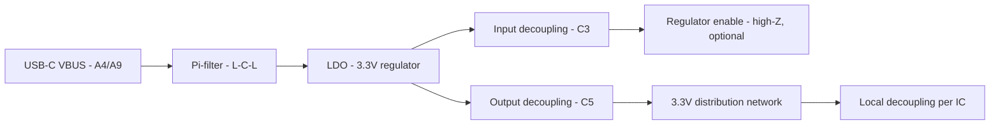

# Power & Ground Routing  

## Overview  

This section documents the methodology used to route the power distribution network (PDN) and ground planes for a two‑layer board that supplies a 3.3 V rail from a USB‑C VBUS input. The focus is on **robust, low‑impedance power delivery**, **minimal impact on signal integrity**, and **manufacturability**. All recommendations are derived from the design choices made for this board and are supported by standard PCB engineering practice.  

## 1. Power‑Flow Topology  

* The **primary power path** follows the sequence **VBUS → Pi‑filter → LDO → output decoupling → 3.3 V rail**.  
* Each **IC power pin** is fed **through a local decoupling capacitor first**, then the trace reaches the IC pad. This ordering uses the trace’s inductance and resistance together with the shunt capacitor to form a small LC filter, improving decoupling and reducing voltage ripple. [Verified]  

## 2. Trace‑Width Selection  

| Net | Current / Frequency Consideration | Recommended Width | Rationale |
|-----|-----------------------------------|-------------------|-----------|
| 3.3 V rail (main distribution) | Low‑to‑moderate current, < 1 MHz switching | Match pad width (≈ 0.6 mm) or slightly wider | Wide traces lower voltage drop and reduce EMI; the board does not require controlled‑impedance routing. [Verified] |
| Enable pin (high‑Z) | Signal‑level only | Narrow (≈ 0.3 mm) | No appreciable current; a thin trace saves space. [Verified] |
| Ground plane (bottom) | Return path for all signals | Solid copper with minimal cuts | Provides low‑impedance reference and shields signals. [Verified] |

* When the pad size is 0.6 mm (e.g., USB‑C VBUS pad), the trace is made the same width to avoid bottlenecks. [Inference]  
* For designs with **higher current** or **fast switching**, a polygon pour (copper fill) would be preferred; here, discrete wide traces are sufficient. [Inference]  

## 3. Routing Strategy  

### 3.1 Power Net (3.3 V)  

1. **Start at the LDO output pad** with a wide trace.  
2. **Route to the first decoupling capacitor (C5)**; keep the trace short and wide.  
3. **From each decoupling capacitor**, branch to the nearest IC power pins, always **trace → capacitor → pad**.  
4. **Neck down** the trace only when necessary to pass between components or to reach a tighter pad pitch.  

### 3.2 Enable & Bypass Pins  

* The **enable pin** (high‑impedance) is routed with a narrow trace directly to its pad; no decoupling is required.  
* **Bypass pins** (e.g., VOS) receive a short, wide trace to an external capacitor, placed as close as possible to the pin.  

### 3.3 Via Usage & Layer Jumps  

* **Vias are used sparingly** to preserve the bottom ground plane.  
* When a jump is required, the workflow is:  
  1. Route on the current layer.  
  2. Press **V** to place a via and switch layers automatically.  
  3. Continue routing on the new layer.  
* The **bottom layer remains primarily a solid ground plane** with only a few small cuts for necessary power jumps. [Verified]  

## 4. Ground Plane Management  

### 4.1 Bottom Ground Plane  

* A **continuous copper pour** on the bottom layer serves as the primary reference.  
* **Four small cuts** are introduced only where a power trace must cross; each cut is kept minimal to avoid compromising plane integrity.  

### 4.2 Top Ground Plane  

* A **polygon pour on the top layer** is added after routing the power nets.  
* **Thermal reliefs** are used for through‑hole pads, but the relief gap can be reduced (e.g., to 0.25 mm) if the pad lies near a congested area. [Inference]  
* Pads that require a **solid connection** (e.g., to improve solderability or when thermal reliefs cause insufficient copper) are manually set to *solid* rather than *thermal*.  

### 4.3 Antenna Mitigation  

* Isolated copper islands (single‑via “islands”) act as **high‑frequency antennas** and are eliminated by:  
  * Deleting the via or merging the island into a larger copper area.  
  * Adding **keep‑out zones** to trim unnecessary polygon extensions.  

### 4.4 Stitching Vias  

* **Stitching vias** tie the top and bottom ground planes together, reducing plane inductance and improving EMI performance.  
* Placement is based on a **fraction of the wavelength** of the highest frequency of concern (commonly 1/10 – 1/20 λ). For typical board‑level frequencies (< 1 GHz), a spacing of **10 mm–15 mm** is adequate, but exact values should be derived from a wavelength calculation. [Inference]  
* Vias are placed **around the board perimeter and near large copper pours** to create a “Swiss‑cheese‑free” ground.  

## 5. Design‑Rule & Manufacturing Checks  

1. **Run a Design Rule Check (DRC)** after each major routing step to catch clearance violations, unconnected nets, and copper‑island issues early.  
2. **Verify that all power pins are connected** through the intended trace‑→‑capacitor‑→‑pad sequence; any deviation can degrade decoupling.  
3. **Inspect thermal‑relief connections**: ensure that pads requiring high solderability have sufficient copper, and adjust relief size or switch to solid connections as needed.  
4. **Check for isolated copper islands** after polygon pours; delete or merge them before finalizing the board.  
5. **Confirm via stitching density** meets the EMI requirements for the intended frequency range.  

Running DRC **iteratively** (e.g., after routing each major net) prevents the accumulation of hundreds of errors at the end of the project. [Verified]  

## 6. Final Clean‑Up  

* **Silk‑screen**: Add reference designators, polarity marks for capacitors, and any required assembly notes.  
* **Text & Labels**: Include board name, revision, and safety warnings directly on the silkscreen.  
* **Export Manufacturing Files**: Gerbers, drill files, and assembly drawings are generated after the final DRC passes with **no errors**.  

## 7. Key Takeaways  

| Aspect | Best Practice |
|--------|----------------|
| **Power trace width** | Match pad width or go wider for low‑impedance distribution. |
| **Decoupling placement** | Always route **trace → capacitor → IC pad** to exploit trace inductance as a filter. |
| **Ground plane** | Keep one layer solid; use minimal cuts; add a complementary pour on the opposite layer. |
| **Via stitching** | Space stitching vias at ≤ 1/10 λ of the highest frequency of interest to suppress resonances. |
| **Thermal reliefs** | Reduce relief gap or switch to solid pads when clearance is tight. |
| **DRC workflow** | Run checks incrementally; fix issues before proceeding to the next routing stage. |

By adhering to these guidelines, the board achieves a **stable 3.3 V rail**, **low‑noise ground reference**, and **manufacturable layout** suitable for low‑to‑moderate current applications without the overhead of controlled‑impedance routing.