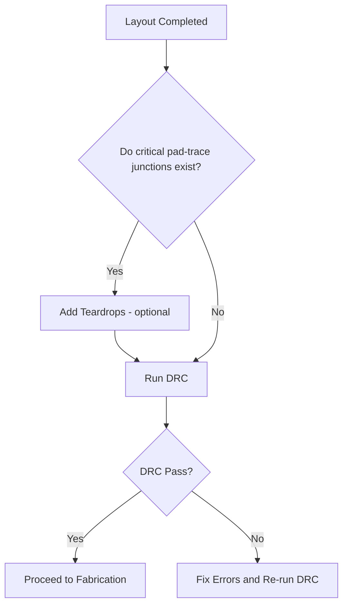

# 23 – Teardrops  

## Overview  

Teardrops are a geometric feature that smoothly blends a copper trace into a pad or via. In the layout view they appear as a “necked‑down” trace that widens toward the pad, resembling the shape of a teardrop. This modest modification can have a noticeable impact on **reliability** and **manufacturability**, especially at the junction where a relatively wide pad meets a narrower trace.  

## Adding Teardrops in KiCad  

In KiCad the teardrop tool is accessed from the pad properties:

1. Select the pad (for example the **VRF+** pad).  
2. Press **E** to open the **Pad Properties** dialog.  
3. Switch to the **Connections** tab.  
4. Click **Add teardrop on pad‑track connection**.  

The dialog presents a set of parameters (shape, size, taper) that can be left at their default values for most designs. KiCad also supports batch‑addition of teardrops through third‑party plugins, although such plugins are not part of the core editor. [Verified]  

## When Teardrops Are Beneficial  

| Situation | Reasoning |
|-----------|-----------|
| **Through‑hole components** where a large copper pad feeds a relatively thin lead or trace. | The enlarged copper area reduces stress concentration and improves solder joint robustness. [Inference] |
| **Boundary interfaces** where a wide pad transitions to a narrower feature (e.g., power pads feeding thin power rails). | The gradual widening mitigates current crowding and eases the copper etching process, lowering the risk of open or thin‑neck failures. [Inference] |
| **High‑vibration or thermal‑cycling environments**. | The smoother geometry distributes mechanical strain more evenly, extending fatigue life. [Inference] |

For a simple, low‑density board with modest current and mechanical demands, the added layout effort may not be justified. In such cases it is acceptable to omit teardrops, provided that a final **Design Rule Check (DRC)** confirms that all connections are intact. [Verified]  

## Impact on Reliability and Manufacturability  

- **Reliability** – Teardrops increase the copper cross‑section at the pad‑trace junction, reducing the likelihood of trace cracking under thermal expansion or mechanical flex.  
- **Manufacturability** – The gradual transition eases the photolithography and etching steps, decreasing the chance of under‑etch or over‑etch at sharp corners. Some PCB fabricators explicitly list teardrops as a DFM recommendation for mixed‑size pad/trace transitions. [Speculation]  

## Design Flow Integration  

After completing the layout (with or without teardrops), the design should be validated with a DRC run. The DRC not only checks clearance and width rules but also verifies that every pad‑track connection is electrically intact—a step that would flag any missing teardrop‑related connections if they were required.  

*The flowchart illustrates the optional decision point for adding teardrops before the final DRC step.*  

## Practical Recommendation  

- **Simple boards** (few layers, modest current, no high‑vibration requirements): omit teardrops to keep the layout process fast, but still perform a thorough DRC.  
- **Boards with through‑hole power or ground pads**, or where a wide pad feeds a narrow high‑current trace: enable teardrops on those interfaces to gain the reliability and DFM benefits.  
- **Batch addition**: consider a plugin if many pads require teardrops, but verify that the generated geometry complies with the manufacturer’s design‑for‑manufacturing guidelines.  

By following this guidance, designers can make an informed choice about teardrop usage, balancing layout effort against the tangible gains in board robustness and yield.