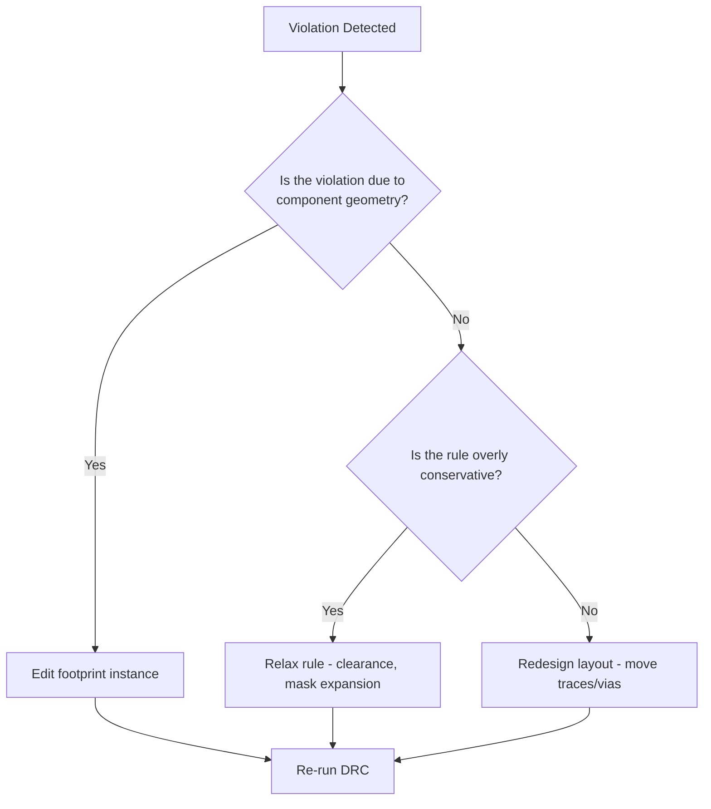

# Design Rules Check (DRC) – Workflow, Common Issues, and Best‑Practice Strategies  

## 1. Overview of the DRC Process  

Before running a Design Rules Check the board should be **fully refreshed**:

1. **Refill all copper zones** – guarantees that any recent track edits or via placements are reflected in the copper pours.  
2. **Select “Show Errors and Warnings”** – ensures that both critical violations and lower‑severity concerns are reported.  
3. **Run DRC** – validates the layout against the rule set defined in *Board Setup*.

```mermaid
flowchart TD
    A[Refresh copper zones] --> B[Configure DRC view (errors + warnings)]
    B --> C[Run Design Rules Check]
    C --> D{Violations found?}
    D -->|Yes| E[Analyse & resolve]
    D -->|No| F[Proceed to manufacturing data]
    E --> C
```

*The loop continues until the board reports zero errors and, ideally, zero warnings.* `[Verified]`

## 2. Typical Violations Encountered  

| Violation Type | Typical Cause | Recommended Remedy |
|----------------|---------------|--------------------|
| **Clearance violation** (e.g., default 0.152 mm vs. actual 0.150 mm) | Design rule set is tighter than the layout; unit conversion (mm ↔ mil) can hide small mismatches. | Adjust the *Net Class* clearance value to match the layout (e.g., change from 0.152 mm to 0.150 mm) **or** increase the spacing in the layout. `[Verified]` |
| **Solder‑mask aperture bridge (different nets)** | Fine‑pitch packages (LQFP, IMU) where the mask opening must cover multiple pads; manufacturer’s mask tolerance may be exceeded. | Either (a) lower the severity to *Warning* or *Ignore* for those specific nets, **or** (b) relax the mask expansion in *Design → Board Options → Solder Mask* if the fab can accept it. `[Inference]` |
| **Incomplete thermal relief** | Thermal‑relief spokes were removed manually, leaving a solid copper‑to‑pad connection that the DRC expects to be a relief. | Convert the connection back to a thermal relief, or deliberately change the rule to accept solid connections when thermal mass is low. `[Verified]` |
| **Footprint‑related clearance** (e.g., USB connector mounting pin too close) | Footprint geometry does not respect the board’s clearance rules. | Edit the **instance** of the footprint (not the library) to shorten or reposition offending pads, then rebuild zones. `[Verified]` |

## 3. Managing Violation Severity  

DRC violations can be **re‑classified** without altering the underlying rule set:

1. **Right‑click** a violation in the DRC window.  
2. Choose **“Ignore All of These Errors”** or **“Edit Violation Severity.”**  
3. In the *Design for Manufacturing* section, locate the specific rule (e.g., *Solder Mask Aperture Bridges – Items with Different Nets*) and set its severity to *Warning* or *Ignore*.  

> **Best practice:** Use severity changes **sparingly** and only for issues that are truly acceptable from a manufacturability standpoint (e.g., fine‑pitch mask openings). Keep a record of any ignored rules for future design reviews. `[Inference]`

## 4. Systematic Error Resolution  

### 4.1. Clearance Adjustments  

- Open **Board Setup → Design Rules → Net Classes**.  
- Reduce the *Minimum Clearance* from the overly‑conservative 0.152 mm to the actual layout value (e.g., 0.150 mm).  
- Re‑run **“Rebuild All Zones”** (shortcut **B**) to propagate the change.  

> This approach preserves a safety margin while eliminating false‑positive violations. `[Verified]`

### 4.2. Thermal‑Relief Fixes  

- **Option A – Solid Connection:** If the pad’s thermal mass is low, change the pad’s *Thermal Relief* property to *Solid* in the pad editor.  
- **Option B – Polygon Cutout:** Insert a predefined polygon cutout around the pad, then rebuild zones and manually connect the copper.  

> Choose the method that best balances **thermal performance** against **DRC compliance**. `[Inference]`

### 4.3. Footprint Editing (Instance‑Only)  

When a component’s mechanical envelope conflicts with clearance rules:

1. Select the component (e.g., **J1 – USB connector**) and press **E** → *General*.  
2. Click **“Edit Footprint”** – this opens the footprint editor **for the board instance only**; the library footprint remains unchanged.  
3. Reduce pad length (e.g., from 1.15 mm to 1.00 mm) and shift the pad upward by half the removed length (≈ 0.075 mm) to keep the top edge aligned with neighboring pads.  
4. Save the edited footprint locally and verify the board updates.  

> Editing the instance preserves library integrity while allowing quick fixes for a single board revision. `[Verified]`

## 5. Decision Matrix: When to Modify Rules vs. When to Redesign  



- **Component geometry issues** → *Edit instance footprint* (preserves library).  
- **Rule conservatism** (e.g., clearance set far above fab capability) → *Relax rule* after confirming with the manufacturer.  
- **Layout constraints** (e.g., routing density) → *Redesign* rather than compromising reliability.  

> This matrix helps maintain a **balanced trade‑off** between manufacturability, cost, and performance. `[Inference]`

## 6. Final Verification Checklist  

| Item | Target | Comments |
|------|--------|----------|
| **DRC Errors** | 0 | All critical violations must be resolved. |
| **DRC Warnings** | 0 (or documented) | Warnings should be either eliminated or explicitly justified (e.g., fine‑pitch mask). |
| **Zone Refill** | Completed after every major edit | Guarantees copper pour integrity. |
| **Manufacturing Review** | Completed | Verify that any relaxed rules are within the fab’s capability sheet. |
| **Footprint Consistency** | Library unchanged, instance edited | Prevents unintended propagation to other designs. |

## 7. Lessons Learned & Best Practices  

- **Refresh copper zones before every DRC run** – avoids false clearance violations caused by stale zone data. `[Verified]`  
- **Maintain a buffer** between design rules and manufacturing minima; a modest reduction (e.g., 0.02 mm) is acceptable when the original rule was intentionally generous. `[Inference]`  
- **Use severity overrides judiciously** – only for violations that are truly benign (e.g., unavoidable mask bridges on fine‑pitch components). Keep a log for future audits. `[Inference]`  
- **Prefer instance‑level footprint edits** over library changes for board‑specific fixes; this preserves the integrity of shared libraries. `[Verified]`  
- **Always cross‑check with the fab’s DFM guidelines** before relaxing any rule; some manufacturers can accommodate tighter clearances, others cannot. `[Speculation]`  
- **Document every ignored or relaxed rule** in the design notes to ensure downstream teams (assembly, quality) are aware of the rationale. `[Inference]`

---  

*By following the systematic approach outlined above, designers can achieve a clean DRC report, maintain design intent, and ensure that the final PCB is both manufacturable and reliable.*