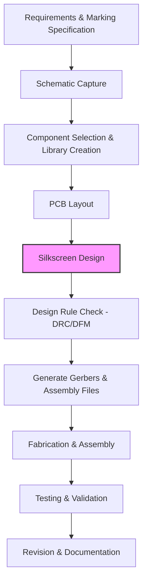

# Silkscreen Layer Guidelines  

*File: `25_silkscreen.md`*  

---

## 1. Purpose and Typical Content  

The silkscreen (also called legend) layer is the visual “paper‑back” of a PCB. It is used to convey information that is useful during assembly, testing, and field service, without affecting the electrical performance of the board. Typical items placed on the **top silkscreen** include:

- **Board title** and **revision identifier** (e.g., “Rev A”).  
- **Date code**, **designer initials**, and **company logo**.  
- **Component designators** (R1, C5, U2, …) for reference during manual assembly or debugging.  
- **Pin‑1 indicators** for ICs, connectors, and polarized parts.  
- **Regulatory or safety markings** required by the target market (e.g., CE, UL).  

These items are purely cosmetic but become part of the **manufacturing documentation** and therefore must be reviewed for legibility and compliance.  

---

## 2. Top vs. Bottom Silkscreen – Cost and Process Considerations  

| Aspect | Top Silkscreen | Bottom Silkscreen |
|--------|----------------|-------------------|
| **Typical usage** | Almost always used for component legends and board identification. | Often omitted unless the board is double‑sided populated or the bottom side is visible to the user. |
| **Manufacturing impact** | Requires one silk‑printing step per panel. | Adds a second silk‑printing step, increasing panel time and cost. |
| **Cost implication** | Baseline cost for a single silk layer. | **[Verified]** “The manufacturer now doesn't have to print any silk screen on the bottom layer in volume and that can make things cheaper.” |
| **Design freedom** | Full freedom to place legends, but must avoid copper pads, vias, and holes. | Must be even more careful because the bottom side often contains solder mask and copper pours that can obscure text. |

**Decision guidance** – If the bottom side will never be seen by the end‑user and no special markings are required, **omit the bottom silkscreen** to reduce process steps and cost. This is a common DFM (Design‑for‑Manufacturability) optimisation.  

---

## 3. Text Placement, Font Selection, and Legibility  

- **Font choice**: Any vector font supported by the CAD tool can be used; however, a **simple, sans‑serif font** (e.g., Arial, Helvetica) yields the cleanest print and the highest contrast.  
- **Size**: Text should be large enough to be readable after the board is fabricated (typically ≥ 0.2 mm height for 1.6 mm FR‑4).  
- **Orientation**: Keep text upright relative to the board’s primary axis; avoid rotating text more than 45° unless required for space constraints.  
- **Clearance**: Maintain a minimum clearance of at least **0.2 mm** (or the manufacturer’s specified value) between silkscreen strokes and any copper features, pads, or vias.  

These practices minimise the risk of **silk‑to‑copper bridging** during the printing process.  

---

## 4. Pin‑1 and Component Designator Indicators  

Pin‑1 markers (often a small “1” or a triangle) are essential for correctly orienting ICs, connectors, and polarized components.  

- **Placement**: Position the marker **outside the copper pad** and **away from the drilled hole** to avoid ink covering the plated through‑hole.  
- **Visibility**: Ensure the marker is not obscured by solder mask or component bodies.  

**[Verified]** “We have all the pin‑one indicators… we’ve got a bit of silk screen text around it.”  

---

## 5. Avoiding Silk on Holes and Exposed Copper  

Silkscreen ink that lands on a drilled hole or on exposed copper can cause several problems:

1. **Solderability degradation** – Ink residues act as a barrier to solder wetting, leading to weak joints. **[Verified]** “If we get silk screen on top of the exposed copper… it can worsen the solderability of the board.”  
2. **Masking of visual cues** – Hole identifiers (e.g., mounting holes, test points) become unreadable.  

**Best practice** – Keep a **clearance margin** (typically ≥ 0.15 mm) between any silkscreen element and the edge of a drilled hole or exposed copper area. If a component’s mechanical features (e.g., a through‑hole pin) are close to a legend, consider moving the legend or the hole in the layout.  

---

## 6. DFM Checklist for Silkscreen  

| Item | Why it matters | Recommended action |
|------|----------------|--------------------|
| **No silk on copper pads** | Prevents solder mask adhesion issues. | Use DRC rule “Silk‑to‑Copper clearance”. |
| **No silk on drilled holes** | Avoids solderability problems. | Add a “Silk‑to‑Hole” clearance rule. |
| **Adequate text size** | Guarantees readability after fabrication. | Verify against manufacturer’s minimum font height. |
| **Consistent font** | Improves visual uniformity and reduces printing errors. | Choose a single font for the entire board. |
| **Mandatory markings** (e.g., safety symbols) | Required for regulatory compliance. | Include per applicable standards; **[Speculation]** may be needed for specific markets. |
| **Bottom silkscreen omission** | Reduces cost and process steps. | Disable bottom silkscreen layer if not needed. |

Running a **silkscreen DRC** (Design Rule Check) before generating manufacturing files catches most of these issues early.  

---

## 7. Impact on Solderability  

Silkscreen ink is typically an epoxy‑based material that cures at relatively low temperatures. When ink lands on a copper surface that will later be soldered, it can:

- **Increase contact resistance** between the pad and the solder joint.  
- **Create voids** in the solder fillet, leading to mechanical weakness.  

Therefore, **silkscreen should never overlap with any area that will be soldered** (pads, exposed copper, via barrels). This rule is especially critical for **high‑reliability or high‑current designs** where joint integrity is paramount.  

---

## 8. Manufacturing File Generation – Gerbers and Silkscreen  

The **minimum Gerber set** required for PCB fabrication includes:

1. **Copper layers** (top, bottom, internal if multilayer).  
2. **Solder mask layers** (top, bottom).  
3. **Silkscreen layers** (top, optional bottom).  
4. **Paste layers** (for SMT assembly).  
5. **Board outline** (mechanical layer).  

When the bottom silkscreen is omitted, the Gerber file for that layer is simply not generated, which **reduces the data set** the fab must process.  

**Best practice** – Before exporting Gerbers:

- Run a **final ERC/DRC** to verify electrical connectivity and mechanical clearances.  
- Perform a **visual inspection** of the silkscreen layers in the CAM viewer to ensure no text overlaps prohibited areas.  

---

## 9. PCB Development Flow (Including Silkscreen)  

*The silkscreen design step (E) is a distinct activity that follows physical layout but precedes the final DRC/DFM checks. It is highlighted to stress its impact on cost, manufacturability, and board readability.*  

---

## 10. Summary  

- **Use only the top silkscreen** unless the bottom side requires visible legends; omitting the bottom layer saves a printing step and reduces cost. **[Verified]**  
- Keep silkscreen **clear of holes and exposed copper** to preserve solderability and visual clarity. **[Verified]**  
- Add **revision, date, designer initials, and company name** to the top silkscreen for traceability. **[Verified]**  
- Apply **DFM‑oriented clearances** (silk‑to‑copper, silk‑to‑hole) and run a dedicated **silkscreen DRC** before Gerber export.  
- Include the silkscreen layers in the **Gerber package** only if they are used; otherwise, the fab will receive a smaller data set, simplifying the manufacturing workflow.  

Following these guidelines ensures a clean, readable board legend, minimizes manufacturing cost, and avoids reliability pitfalls associated with poorly placed silkscreen.