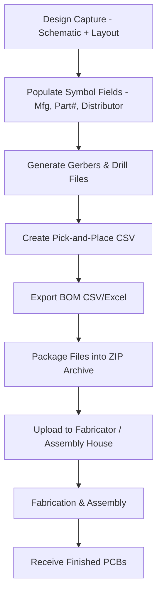

# Manufacturing Files  

This chapter describes the complete set of deliverables required to move a PCB design from the layout tool to a fabricator and, optionally, to an assembly house. It covers **Gerber generation**, **drill file creation**, **pick‑and‑place (component placement) files**, and the **bill of materials (BOM)**. The recommended workflow, file formats, and practical tips are illustrated with a typical low‑cost fabricator (e.g., JLCPCB) but are applicable to any manufacturer that accepts standard IPC‑2581/IPC‑274X data.

## 1. Overview of the Manufacturing Data Package  

| Deliverable | Primary Purpose | Typical File Extension | Required for |
|-------------|----------------|------------------------|--------------|
| **Gerber files** | Define copper, solder mask, silkscreen, and board outline | `.gbr`, `.gbrx` (X‑2) | Fabrication |
| **Drill files** | Specify locations and sizes of plated‑through (PTH) and non‑plated (NPTH) holes | `.drl` (Excellon) | Fabrication |
| **Pick‑and‑place file** | Lists X/Y centre coordinates, rotation, and layer for every component | `.csv`, `.txt`, `.xlsx` | Assembly |
| **Bill of Materials (BOM)** | Enumerates part numbers, manufacturers, quantities, and sourcing links | `.csv`, `.xls` | Assembly (and procurement) |

When only board fabrication is needed, the **Gerber archive** (Gerbers + drill files) is sufficient. For turnkey assembly, the **pick‑and‑place** and **BOM** must accompany the archive.

## 2. Gerber Generation  

### 2.1 Layer Selection  

A typical 2‑layer board requires the following layers:

| Layer | Description | Export Needed? |
|-------|-------------|----------------|
| **Top copper** | Signal and power traces on the component side | ✅ |
| **Bottom copper** | Ground/power plane or additional routing | ✅ |
| **Top solder mask** | Protects copper, defines expose area | ✅ |
| **Bottom solder mask** | Usually required even if no components are on the bottom | ✅ |
| **Top silkscreen** | Reference designators, logos, etc. | ✅ |
| **Bottom silkscreen** | Omitted if no bottom components | ❌ |
| **Top paste mask** | Stencil for SMT solder paste | ✅ (if SMT) |
| **Bottom paste mask** | Omitted if no bottom SMT parts | ❌ |
| **Edge cuts** | Board outline and mechanical features | ✅ |

> **Why omit bottom paste/silkscreen?**  
> If no components are placed on the bottom side, generating those layers adds unnecessary data and can confuse the fab’s CAM software. [Verified]

### 2.2 File Format Choices  

| Format | Advantages | When to Use |
|--------|------------|-------------|
| **X‑2 (Extended Gerber)** | Supports embedded attributes (e.g., layer polarity, aperture macros) and is the current IPC‑274X standard. | Recommended for all modern fabricators. |
| **RS‑274X (standard Gerber)** | Widely supported, but lacks some attribute capabilities. | Legacy houses that have not upgraded. |
| **ODB++ / IPC‑2581** | Single‑file, rich metadata (stackup, netlist, test points). | High‑volume or high‑complexity production where the fab explicitly supports it. |

Most low‑cost manufacturers still require the classic Gerber set; therefore **X‑2** is the safest choice. [Verified]

### 2.3 Origin and Units  

- **Origin**: Set to the **bottom‑left corner** of the board (default for many tools). This matches the coordinate system used by most pick‑and‑place machines. [Verified]  
- **Units**: Millimetres are preferred for Asian fabricators (e.g., JLCPCB) because their CAM pipelines expect metric data. [Verified]

### 2.4 Export Procedure (KiCad example)  

1. **File → Fabrication Outputs → Gerbers**.  
2. Choose an output directory (e.g., `project_root/manufacturing`).  
3. Select the layers listed in §2.1.  
4. Enable **X‑2 format** and **drill origin** (same as Gerbers).  
5. **Uncheck** “Generate job file” unless the fab explicitly requests a fabrication job file.  
6. Click **Plot** → verify the generated files.  

> **Tip:** Keep the Gerber filenames short and descriptive (e.g., `TopCopper.gbrx`). Some older CAM tools truncate long names, causing layer mismatches. [Inference]

## 3. Drill File Generation  

### 3.1 Excellon Format  

The **Excellon** (or **NC**) format is the de‑facto standard for drill data. It lists hole coordinates, diameters, and whether the hole is plated (PTH) or non‑plated (NPTH).  

- **Units**: Millimetres (consistent with Gerbers).  
- **Zero suppression**: Decimal format (e.g., `0.000`) is widely accepted; avoid leading/trailing zeros unless the fab specifies otherwise. [Verified]

### 3.2 Export Steps  

1. **File → Fabrication Outputs → Drill Files**.  
2. Choose the same output folder as the Gerbers.  
3. Select **Excellon** as the format.  
4. Set **origin** to the same bottom‑left corner.  
5. Keep default drill‑file options unless the fab requests a specific drill map.  
6. Click **Generate**.  

The resulting archive will contain at least two files:  

- `drill_PTH.drl` – plated‑through holes (e.g., vias, mounting holes).  
- `drill_NPTH.drl` – non‑plated holes (e.g., mechanical slots, programming headers).  

> **Why separate NPTH?**  
> Some manufacturers charge differently for plated vs. non‑plated holes; separating them simplifies cost estimation. [Inference]

## 4. Assembly Data  

### 4.1 Pick‑and‑Place (Component Placement) File  

The pick‑and‑place file tells the assembly line **where** each component’s centre lies, **how it is oriented**, and **on which side** of the board it belongs.

#### Required Columns (CSV example)

| Column | Meaning |
|--------|---------|
| `Designator` | Reference (e.g., `U1`, `C5`). |
| `Footprint` | Library footprint name (helps the machine select the correct nozzle). |
| `MidX` | X‑coordinate of component centre (mm). |
| `MidY` | Y‑coordinate of component centre (mm). |
| `Rotation` | Angle in degrees (0 = top‑side, 0° = pin 1 up). |
| `Layer` | `Top` or `Bottom`. |

> **Manufacturer quirks:**  
> JLCPCB’s assembler expects the header exactly as shown above and may reject files lacking quotation marks around string fields. Adding quotes is a harmless workaround. [Verified]  

#### Export Procedure (KiCad example)

1. **File → Fabrication Outputs → Component Placement**.  
2. Set **Units** to **mm**, **Format** to **CSV**.  
3. Click **Generate Position File**.  
4. If the generated header differs from the assembler’s template, rename columns accordingly (e.g., `Reference` → `Designator`).  

### 4.2 Bill of Materials (BOM)  

The BOM provides the **part numbers**, **manufacturers**, **distributors**, and **quantities** required for assembly. It is also the basis for cost estimation and procurement.

#### Recommended Fields

| Field | Purpose |
|-------|---------|
| `Designator` | Links to placement file. |
| `Quantity` | Number of parts required. |
| `Value` | Electrical value (e.g., `10 kΩ`). |
| `Footprint` | Confirms mechanical compatibility. |
| `Manufacturer` | For traceability. |
| `Mfg Part #` | Exact part identifier. |
| `Distributor` / `Distributor Part #` | Direct ordering link (e.g., LCSC, Digi‑Key). |
| `Description` | Optional free‑form notes. |

> **Best practice:** Populate these fields **in the schematic symbol library** before routing. This avoids manual entry errors later and ensures the exported BOM is complete. [Verified]

#### Export Procedure (KiCad example)

1. Switch to the **Schematic Editor**.  
2. Verify each symbol’s fields (Reference, Value, Footprint, Manufacturer, Part #, Distributor).  
3. **File → Fabrication Outputs → Bill of Materials**.  
4. Choose **CSV** (or Excel) and click **Export**.  
5. Adjust the header row if the assembler expects different names (e.g., `Reference` → `Designator`).  

> **Common pitfall:** Selecting the wrong package size (e.g., 0605 vs. 0805) leads to mismatched footprints and assembly errors. Always double‑check the footprint‑to‑part mapping before export. [Inference]

## 5. Packaging & Submission  

1. **Create a ZIP archive** containing:  
   - All Gerber files (`*.gbrx`).  
   - Drill files (`*.drl`).  
   - Pick‑and‑place CSV.  
   - BOM CSV/Excel.  

2. **Naming convention** (recommended): `ProjectName_RevA_Manufacturing.zip`.  

3. **Upload** the archive to the fabricator’s portal (e.g., JLCPCB “Instant Quote”).  

4. **Select options** (board thickness, copper weight, surface finish) and **confirm** that the fab has accepted the file set (most portals run an automated DRC check).  

> **Note:** Some manufacturers provide a “preview” of the board stackup and drill map after upload. Use this to verify that the origin and units are interpreted correctly. [Speculation]

## 6. Manufacturer‑Specific Considerations (JLCPCB Example)  

| Aspect | JLCPCB Requirement | Rationale |
|--------|-------------------|-----------|
| **Gerber format** | X‑2 (or RS‑274X) | Supports attribute data; widely accepted. |
| **Drill file** | Excellon, metric, decimal zeros | Matches their CAM pipeline. |
| **Pick‑and‑place header** | `Designator,Footprint,MidX,MidY,Rotation,Layer` (quoted strings) | Their parser is strict about column order and quoting. |
| **BOM header** | `Designator,Quantity,Value,Footprint,Manufacturer,Manufacturer Part #,Distributor,Distributor Part #` | Enables automatic component sourcing from LCSC. |
| **File archive** | Single ZIP (no nested folders) | Simplifies automated extraction. |

If any of these constraints are violated, the order will be rejected or delayed, often with a generic “file format error” message.  

> **Tip:** Keep a **template CSV** for both pick‑and‑place and BOM that matches the fab’s exact header. Copy‑paste the generated file into the template and adjust only the data rows. [Inference]

## 7. Best Practices & Common Pitfalls  

| Practice | Why it matters |
|----------|----------------|
| **Consistent origin** across Gerbers, drills, and placement files | Prevents systematic offset errors during assembly. |
| **Metric units** for all files | Avoids conversion mistakes; most Asian fabs default to metric. |
| **Use X‑2 Gerbers** even if the fab accepts RS‑274X | Future‑proofs the design and preserves layer attributes. |
| **Populate library fields early** (manufacturer, part #, distributor) | Guarantees a complete BOM and reduces manual entry errors. |
| **Validate the ZIP archive** with the fab’s preview tool before ordering | Catches missing layers or mismatched drill files early. |
| **Quote the exact stack‑up** (copper weight, mask clearance) in the order form | Prevents unexpected cost increases or performance deviations. |
| **Check component orientation** (rotation) in the placement file | Mis‑rotated parts cause assembly failures, especially for polarized devices. |
| **Separate PTH and NPTH drill files** when possible | Some fabs charge per plated hole; clear separation aids cost estimation. |
| **Keep a version‑controlled copy** of the manufacturing archive | Enables repeat orders and traceability for revisions. |

## 8. Process Flow Diagram  

*The flow emphasizes that **symbol field population** precedes all export steps, ensuring a complete BOM and accurate placement data.*  
