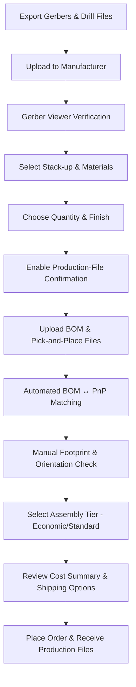

# Ordering – Fabrication & Assembly Workflow  

## 1. Design‑to‑Production Verification  

Before any files are sent to the fab house, a **double‑check** of the exported data is essential.  

* **Gerber preview** – Use the manufacturer’s online viewer (or a third‑party Gerber viewer) to confirm that:  
  * The number of copper layers matches the schematic (two‑layer in this case).  
  * Board outline, drill holes, silk‑screen, solder‑mask openings and copper pours are all present and correctly positioned.  
* **Dimension extraction** – The automated system should read the board size (53 mm × 28 mm) and layer count without manual entry.  

> *Why?* A visual inspection catches export errors that DRC/ERC cannot see, such as missing drill data or misplaced silkscreen text.  [Verified]

---

## 2. Selecting Board Stack‑up & Materials  

| Parameter | Chosen Value | Rationale |
|-----------|--------------|-----------|
| **Substrate** | FR‑4, 1.6 mm thickness | Standard for two‑layer boards; offers a good balance of cost, mechanical strength and thermal performance. [Verified] |
| **Layers** | 2 copper layers | Sufficient for the simple MSP‑MO microcontroller board; keeps stack‑up simple and inexpensive. [Verified] |
| **Solder mask** | Green | Most common, cheapest, and readily available. [Verified] |
| **Silk screen** | White | High contrast on green mask; standard for visual inspection. [Verified] |
| **Surface finish** | Lead‑free HASL (Hot Air Solder Leveling) – default | Adequate for low‑volume prototypes; low cost and compatible with most component leads. [Verified] |
| **Alternative finish** | ENIG (Electroless Nickel Immersion Gold) – optional | Provides a flatter surface and longer shelf life; recommended for fine‑pitch or high‑reliability parts. [Inference] |

> **Tip:** When the design contains fine‑pitch components (e.g., a 0.5 mm pitch accelerometer), ENIG can improve solder joint reliability and reduce the risk of tombstoning. [Speculation]

---

## 3. Quantity, Pricing & Cost Trade‑offs  

| Item | Quantity | Unit Cost (approx.) | Total |
|------|----------|--------------------|-------|
| PCB fab | 5 pcs (minimum order) | $0.80 / pc | <$4 |
| PCB assembly (top‑side only, standard) | 5 pcs | $15 / pc | <$80 (incl. parts) |
| **Production‑file confirmation fee** | – | $1 / order | $1 |

*The minimum order of five boards keeps the per‑unit cost low while still providing enough units for testing and iteration.* [Verified]  

> **Design‑for‑Cost (DfC) note:** If the design can tolerate a larger batch size, the per‑unit cost of assembly drops further because the fixed setup fee is amortised over more units. [Inference]

---

## 4. Assembly Options – Economic vs. Standard  

| Feature | Economic Assembly | Standard Assembly |
|---------|-------------------|-------------------|
| **Component density** | Suited for through‑hole and larger SMT parts | Handles fine‑pitch (≤0.5 mm) and BGA packages |
| **Placement accuracy** | ±0.2 mm (typical) | ±0.1 mm (tight tolerance) |
| **Supported parts** | Simple resistors, capacitors, connectors | Includes fine‑pitch ICs, accelerometer (U4) |
| **Cost** | Lower | Slightly higher |

Because the board includes a **fine‑pitch accelerometer (U4)**, the **Standard** assembly service is required. [Verified]  

> **Best practice:** When possible, select component packages that match the intended assembly tier. For low‑cost prototypes, using a larger‑pitch version of a sensor can enable the cheaper Economic service. [Speculation]

---

## 5. Production File Confirmation  

Enabling the **“Confirm production files”** option forces the fab house to send back the exact Gerber and drill files they will use for manufacturing. A nominal $1 fee applies.  

*Benefits*  

* Guarantees that the fab’s internal conversion (e.g., from KiCad to their proprietary format) has not introduced errors.  
* Provides a final DFM checkpoint before the board is pressed.  

> **Recommendation:** Always enable this option for any design that will be shipped to a third‑party assembly house. [Verified]

---

## 6. BOM & Pick‑and‑Place Verification  

1. **Upload the “blue‑materials” (BOM) file** and the **pick‑and‑place (PnP) file** in the manufacturer’s required CSV format.  
2. The system cross‑references each line of the BOM with the PnP data:  
   * Checks part numbers, footprints, and package codes.  
   * Flags any mismatches or missing entries.  
3. **Special‑fee components** (e.g., a USB Type‑C connector) are highlighted; accept the additional charge if the part is required.  

> **Why manual review matters:** Automated matching can mis‑interpret similar part numbers or overlook a missing pin‑1 indicator, leading to assembly errors. [Verified]

---

## 7. Footprint & Orientation Validation  

After the BOM check, the platform presents a **visual placement view** (2‑D and 3‑D).  

* **Rotation standards** – Different ECAD tools define “0°” differently (north vs. east). Verify each component’s orientation by:  
  * Selecting the part, pressing **Space** to rotate 90° increments until the silkscreen “1” aligns with the footprint pin‑1.  
* **Missing 3‑D models** – If a component lacks a 3‑D model, the viewer shows a placeholder. This does not affect assembly but should be noted for future documentation.  
* **Pin‑1 indicators** – Ensure every footprint displays a clear pin‑1 marker; missing markers can cause the assembly house to place parts incorrectly.  

> **Best practice:** Keep a library of verified footprints with consistent orientation conventions to minimise manual rotation during the ordering stage. [Speculation]

---

## 8. Final Cost Summary & Shipping  

The checkout page aggregates all charges:  

* PCB fabrication, assembly, special‑component fees, production‑file confirmation, and shipping.  
* The **device usage classification** (e.g., “Research/Education – Development Board”) is required for customs documentation.  

> **Tip:** Selecting the correct usage category can reduce import duties and expedite clearance. [Speculation]

---

## 9. End‑to‑End Ordering Flowchart  

*The flowchart captures the critical decision points and verification steps that ensure a reliable, cost‑effective order.* [Verified]

---

## 10. Key Takeaways & Best‑Practice Checklist  

| ✔️ Action | Reason |
|----------|--------|
| **Run a Gerber viewer** before upload | Catches missing layers, drill errors, or mis‑aligned silkscreen. |
| **Confirm production files** (pay $1) | Guarantees the fab’s internal data matches the designer’s intent. |
| **Select appropriate surface finish** (HASL vs. ENIG) | Balances cost, shelf life, and fine‑pitch solderability. |
| **Choose assembly tier based on component pitch** | Prevents unexpected extra fees or assembly failures. |
| **Validate BOM ↔ PnP mapping line‑by‑line** | Avoids mismatched parts and hidden special‑fee items. |
| **Inspect component orientation in 2‑D/3‑D view** | Resolves differing “0°” conventions across ECAD tools. |
| **Check pin‑1 markers and missing 3‑D models** | Ensures correct placement and future documentation quality. |
| **Declare correct device usage for customs** | Minimises shipping delays and duty costs. |

By following these steps, designers can move from a completed schematic/layout to a **reliable, low‑cost production run** with confidence that the fabricated boards will match the intended design and that assembly will proceed without surprise re‑work. [Verified]