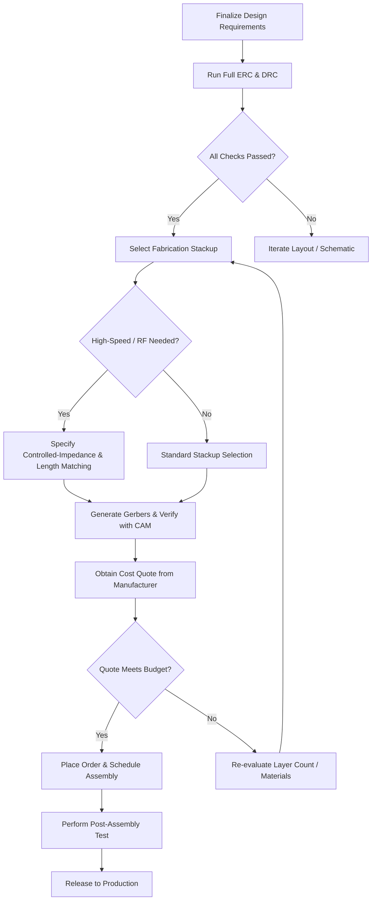

# Closing Remarks & Path Forward  

In the final stage of any PCB project, the focus shifts from the technical execution to **knowledge consolidation** and **continuous improvement**.  The most sustainable way to keep delivering high‑quality designs is to combine hands‑on practice with structured learning that covers both the fundamentals and the cutting‑edge techniques of modern hardware engineering.

## 1. Why Ongoing Education Matters for PCB Engineers  

- **Rapid technology evolution** – New process nodes, component families, and design‑for‑manufacturability (DFM) guidelines appear regularly, making it essential to stay current.  
- **Cross‑disciplinary expertise** – Mixed‑signal (analog + digital) and high‑speed digital designs each impose distinct constraints on stack‑up, signal integrity, and layout strategy. Mastery of both domains reduces hand‑off errors and shortens development cycles.  
- **Professional credibility** – Formal courses and certifications demonstrate a commitment to best practices, which is valuable when collaborating with contract manufacturers or presenting designs to stakeholders.  

> *Enrolling in dedicated hardware‑design courses that cover mixed‑signal and advanced digital topics provides a curated curriculum that bridges theory and real‑world PCB projects.* [Inference]

## 2. Core PCB Concepts Reinforced by Structured Learning  

| Concept | Typical Learning Outcome | Relevance to Real‑World Designs |
|---------|--------------------------|---------------------------------|
| **Stack‑up design & reference planes** | Ability to select layer counts, dielectric materials, and plane placement to meet impedance and EMI goals. | Direct impact on signal integrity for high‑speed buses and on manufacturability cost. |
| **Controlled‑impedance routing** | Calculation of trace geometry, use of microstrip/stripline models, and verification with simulation tools. | Required for USB 3.0, HDMI, DDR, and other high‑frequency interfaces. |
| **DFM / DFA guidelines** | Recognition of manufacturable pad sizes, via tolerances, and component placement strategies that minimize assembly defects. | Reduces yield loss and lowers per‑board cost. |
| **ERC & DRC best practices** | Configuration of rule sets that catch electrical shorts, clearance violations, and manufacturability issues early in the design flow. | Prevents costly revisions after fabrication. |
| **Creepage & clearance for safety** | Application of standards (e.g., IEC 60950, UL 60950) to high‑voltage sections. | Essential for compliance and product liability. |
| **Differential pair handling** | Length‑matching, skew budgeting, and proper termination techniques. | Critical for high‑speed serial links and RF front‑ends. |

These topics are typically covered in depth by the **mixed‑signal hardware design** and **advanced digital hardware design** courses referenced in the learning resources. [Inference]

## 3. Decision‑Making Framework for the Final Design Phase  

When a board reaches the “ready‑for‑fabrication” milestone, engineers must evaluate a set of trade‑offs that balance performance, cost, and risk.  The flowchart below captures a high‑level decision process that can be applied to any project, regardless of size.

*The diagram reflects a typical **design‑to‑manufacture** workflow and highlights where engineering judgment is required, such as choosing a stack‑up or deciding whether controlled‑impedance routing is justified.* [Inference]

## 4. Best‑Practice Checklist for the “Outro” Phase  

| Area | Recommended Action | Rationale |
|------|-------------------|-----------|
| **Documentation** | Compile a design brief, BOM, and assembly drawings; archive version‑controlled schematic and layout files. | Facilitates future revisions and eases hand‑off to manufacturers. |
| **Design Review** | Conduct a peer review focusing on signal integrity, power integrity, and DFM compliance. | Early detection of hidden issues reduces costly re‑spins. |
| **Simulation Verification** | Run SI/PI simulations for critical nets (e.g., high‑speed differential pairs). | Confirms that impedance and timing budgets are met before tape‑out. |
| **Manufacturing Partner Selection** | Compare capabilities (e.g., number of layers, microvia technology, panelization options) against design requirements. | Aligns board complexity with the supplier’s expertise, avoiding unnecessary lead time. |
| **Learning Integration** | Map any knowledge gaps identified during the project to specific modules in the mixed‑signal or advanced digital courses. | Turns project experience into targeted skill development. |

---

## 5. Continuing the Learning Journey  

- **Enroll in structured courses** that blend theory with hands‑on labs, covering topics from **mixed‑signal design** (analog front‑ends, ADC/DAC integration) to **advanced digital design** (high‑speed serial, multi‑core MCU layout).  
- **Participate in community forums** and **open‑source hardware projects** to observe diverse design styles and receive peer feedback.  
- **Maintain a personal design library** of vetted footprints, stack‑up templates, and DFM checklists; regularly update it as you acquire new knowledge.  

By systematically reinforcing the concepts outlined above and applying them to successive projects, you will steadily improve both the **quality** and **efficiency** of your PCB designs.
